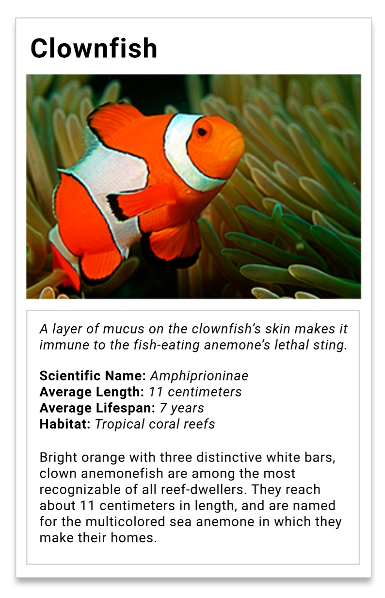

# Animal Trading Card Project

A `design-prototype.jpg` is provided to create a card on a favourite animal. `card.html` is to be modified to include `attributes` and CSS `selectors` is used to style specific elements.

The Lab starts with the following files:

* `card.html`
* `clownfish.jpg`
* `design-prototype.jpg`
* `styles.css`

## 🛠 Required Changes ⚙️

The following changes is required for `card.html`

1. Change the heading to the name of your favorite animal
2. Replace the placeholder image with your favorite animal's image. Change the image's `alt` attribute to the name of your animal.
    i.e. `alt="name-of-your-animal"`. Use an image with a `width` of 300 pixels. 
3. Edit the interesting fact paragraph
4. Edit the key characteristics
5. Edit the informational paragraph

## 💃 Style the Page 🕺

The CSS must apply these styles to match the design prototype:

  1. link your stylesheet `styles.css` to the HTML or else your CSS will not be applied.
  2. give the interesting facts `
` a CSS class of `animal-info`
  3. italicize the text for the animal's interesting fact
  4. bold the labels for the animal's list items
  5. remove dots from the animal's list items
  6. add a border around the animal's name, image, and information
  7. add a border around the animal's information
  8. add padding between the animal's name, image, and information
  
 
## For additional instructions 

[Atlassian|http://atlassian.com]
  
[Click here!|https://github.com/yasmi22r/Udacity_Nanodegree_Program/blob/master/Project_0_Animal_Trading_Cards/instructions.md]

