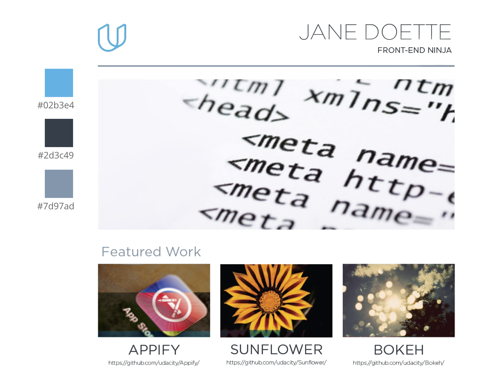

# Portfolio Site

## Overview

Based on the fundamental knowledge learnt throughout the Nanodegree program we are to replicate an initial mockup design in PDF using HTML and CSS. The project entails a functional, responsive website that will display images, descriptions and links to each of the future portfolio projects completed throughout the course of the program.

### Technologies Used

* [HTML5 semantic (structural) elements]("https://developer.mozilla.org/en-US/docs/Learn/HTML/Introduction_to_HTML/Document_and_website_structure#Enter_HTML5_structural_elements") 
* CSS and responsive images

### Instructions

To view the code and make changes:

1. Fork the repository
2. Download the repository to your computer
3. Locate the `index.html` file and open with a browser

More details about project specifications can be found on the following link [review rules](https://review.udacity.com/#!/rubrics/45/view)

### Additional Resources

Some tools used to check our work:

*  [Udacity HTML/CSS Style Guide](https://udacity.github.io/frontend-nanodegree-styleguide/)

*  [HTML Validator](https://validator.w3.org/#validate_by_input)

*  [CSS Validator](https://jigsaw.w3.org/css-validator/#validate_by_input)

*  [HTML5 semantic (structural) elements](https://developer.mozilla.org/en-US/docs/Learn/HTML/Introduction_to_HTML/Document_and_website_structure#Enter_HTML5_structural_elements)

